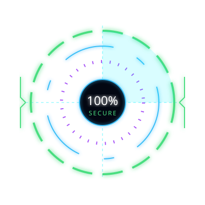

<!-- ========================================================================================= -->
<!--                    SOFTWARE DEVELOPER & SECURITY RESEARCHER // HERO                       -->
<!-- ========================================================================================= -->

  <!-- High-Resolution Animated SVG Banner -->
  

    

  <!-- Responsive Terminal Typing Stream -->
  

   

  <!-- SYSTEM STATUS BADGES (Mobile Responsive) -->
  

    
    
    
    
  

 

 

<!-- ========================================================================================= -->
<!--                    01. ENGINEERING PROFILE & TECHNICAL ARSENAL                            -->
<!-- ========================================================================================= -->

<table width="100%" style="border-collapse: collapse; border: none;">
  <tr>
    <td width="60%" valign="top">
      <h2>⚡ <code>ENGINEERING PROFILE & ARSENAL</code></h2>
      
I build <b>scalable backend systems</b> and <b>responsive frontends</b>, while ensuring robust <b>cybersecurity</b> defenses. My workflow revolves around continuous integration, vulnerability hunting, and clean code.

      
       
      
      
    </td>
    
    <td width="40%" align="center" valign="middle">
      <!-- Custom SVG HUD -->
      
    </td>
  </tr>
</table>

 

| Technical Domain | Technologies & Frameworks |
| :--- | :--- |
| **Frontend & UI** |      |
| **Backend & APIs** |     |
| **Database & ORM** |    |
| **Security & Ops** |     |

 

 

<!-- ========================================================================================= -->
<!--                    02. EXECUTABLE ARCHITECTURES // PROJECTS                               -->
<!-- ========================================================================================= -->

  <!-- Custom SVG Banner for Projects -->
  

 

| Project Designation | System Description | Core Technologies |
| :--- | :--- | :--- |
| **`[SYS.01] NU Wellness`** | **Booking & Consultant Management Platform** Scalable booking system with automated scheduling and time-slot management for consultants. |    |
| **`[SYS.02] Smart Carpooling`** | **Ride Sharing Platform** Eco-friendly student transportation network for route matching and ride sharing. |    |
| **`[SYS.03] Route Mapper`** | **Safe Navigation Concept** Interactive mapping tool identifying safe routes for walking and cycling. |   |
| **`[SEC.01] NetLabs`** | **Cybersecurity Explorations** Network packet analysis, system hardening scripts, and vulnerability assessments. |   |

 

 

<!-- ========================================================================================= -->
<!--                    03. TELEMETRY & SYSTEM METRICS                                         -->
<!-- ========================================================================================= -->

  <h2>📡 <code>SYSTEM TELEMETRY</code></h2>
  
   

  
  

    

  <!-- High-Tech Activity Snake -->
  <picture>
    <source media="(prefers-color-scheme: dark)" srcset="https://raw.githubusercontent.com/platane/snk/output/github-contribution-grid-snake-dark.svg">
    <source media="(prefers-color-scheme: light)" srcset="https://raw.githubusercontent.com/platane/snk/output/github-contribution-grid-snake.svg">
    
  </picture>

 

 

<!-- ========================================================================================= -->
<!--                    04. CONNECTION TERMINATION                                             -->
<!-- ========================================================================================= -->

  

   

  <!-- Custom SVG Footer -->
  

