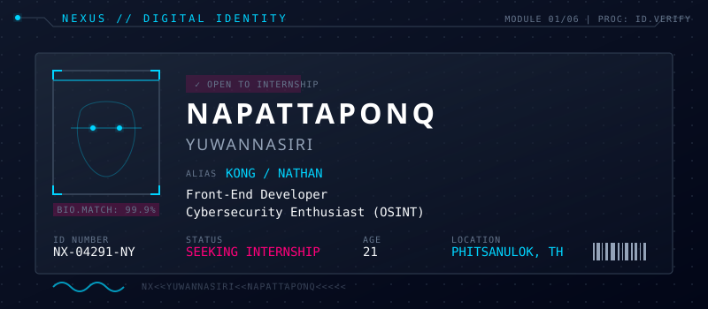
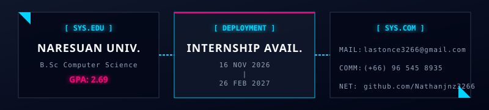
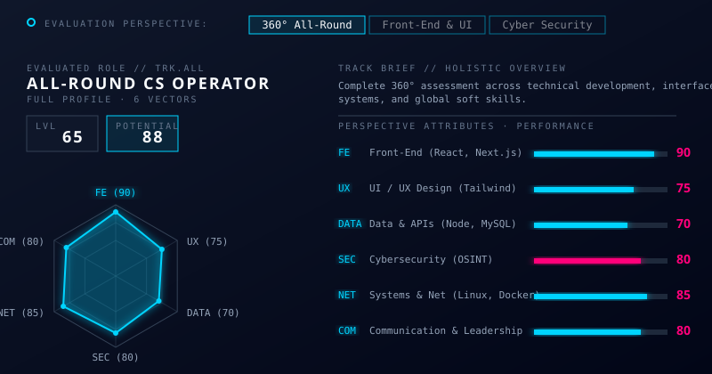
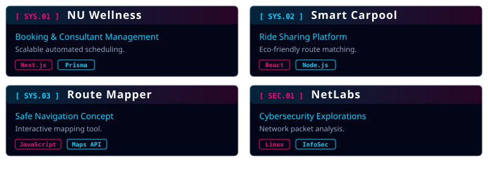
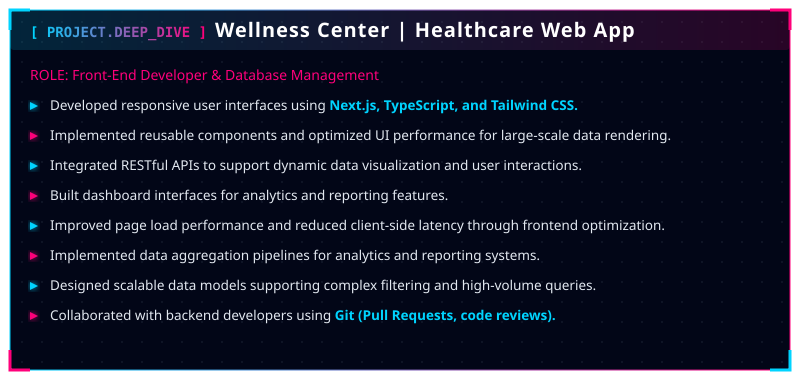
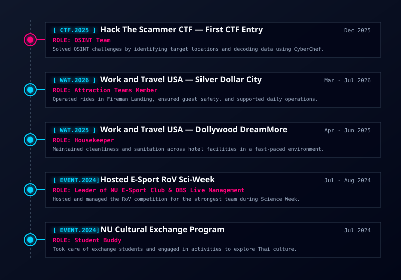

<!-- ========================================================================================= -->
<!--                    NEXUS // DIGITAL IDENTITY // HERO                                      -->
<!-- ========================================================================================= -->

<!-- High-Resolution Animated SVG Banner (Nexus ID) -->

  

<!-- Responsive Terminal Typing Stream -->

 

<!-- SYSTEM STATUS BADGES (Mobile Responsive) -->

<blockquote>
<i>"A 21-year-old fourth-year Computer Science student at Naresuan University with a strong interest in UX/UI Design, Front-End Development, and Software Development. Enjoys designing user-friendly interfaces and developing responsive, functional web applications with a focus on usability, performance, and user experience."</i>
</blockquote>

 

 

<!-- ========================================================================================= -->
<!--                    01. ACADEMICS & COMMUNICATIONS                                         -->
<!-- ========================================================================================= -->

<h2>🎓 <code>ACADEMICS & COMMUNICATIONS</code></h2>

<!-- Academics & Comms HUD -->

 

 

<!-- ========================================================================================= -->
<!--                    02. EVALUATION PERSPECTIVE & SKILLS DASHBOARD                          -->
<!-- ========================================================================================= -->

<!-- Nexus Skills Radar & Progress Bars Dashboard -->

 

<h3><code>[ SYS.SKILLS ]</code> EXPANDED TECHNICAL STACK</h3>

 

<h4>[ PROGRAMMING ]</h4> 
 &nbsp;&nbsp;
 &nbsp;&nbsp;
 &nbsp;&nbsp;

  

<h4>[ WEB DEVELOPMENT & DESIGN ]</h4> 
 &nbsp;&nbsp;
 &nbsp;&nbsp;
 &nbsp;&nbsp;
 &nbsp;&nbsp;
 &nbsp;&nbsp;
 &nbsp;&nbsp;
 &nbsp;&nbsp;
 &nbsp;&nbsp;
 &nbsp;&nbsp;

  

<h4>[ CORE OS & NETWORK ]</h4> 
 &nbsp;&nbsp;
 &nbsp;&nbsp;
 &nbsp;&nbsp;
 &nbsp;&nbsp;

  

<h4>[ AI-ASSISTED DEV ]</h4> 
 &nbsp;&nbsp;
 &nbsp;&nbsp;
 &nbsp;&nbsp;

 

 

<!-- ========================================================================================= -->
<!--                    03. EXECUTABLE ARCHITECTURES // PROJECTS                               -->
<!-- ========================================================================================= -->

<!-- Custom SVG Banner for Projects -->

 
<!-- Unified SVG Dashboard for Projects & HUD -->

 

 

 

<!-- ========================================================================================= -->
<!--                    04. OPERATIONAL HISTORY & DEPLOYMENTS                                  -->
<!-- ========================================================================================= -->

<h2>🌍 <code>OPERATIONAL HISTORY & DEPLOYMENTS</code></h2>

 

<!-- Operational History Timeline HUD -->

 

 

<!-- ========================================================================================= -->
<!--                    05. TELEMETRY & SYSTEM METRICS                                         -->
<!-- ========================================================================================= -->

<h2>📡 <code>SYSTEM TELEMETRY</code></h2>

 

  <!-- GitHub Streak Stats (Wide Panel) -->
  
  
    
  
  <!-- GitHub General Stats -->
  
  &nbsp;&nbsp;
  <!-- Top Languages -->
  

  

<!-- High-Tech Activity Snake -->
<picture>
<source media="(prefers-color-scheme: dark)" srcset="https://raw.githubusercontent.com/platane/snk/output/github-contribution-grid-snake-dark.svg">
<source media="(prefers-color-scheme: light)" srcset="https://raw.githubusercontent.com/platane/snk/output/github-contribution-grid-snake.svg">

</picture>

 

 

<!-- ========================================================================================= -->
<!--                    06. CONNECTION TERMINATION                                             -->
<!-- ========================================================================================= -->

+UNDERSTAND+->+TEST+->+SECURE+->+IMPROVE" alt="Mindset" />
 
<!-- Custom SVG Footer -->

