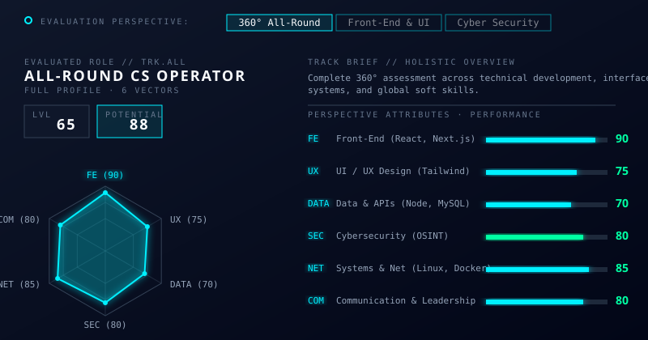
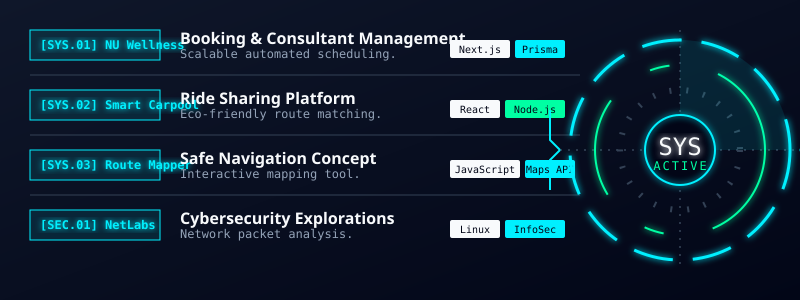

<!-- ========================================================================================= -->
<!--                    NEXUS // DIGITAL IDENTITY // HERO                                      -->
<!-- ========================================================================================= -->

<!-- High-Resolution Animated SVG Banner (Nexus ID) -->

  

<!-- Responsive Terminal Typing Stream -->

 

<!-- SYSTEM STATUS BADGES (Mobile Responsive) -->

<blockquote>
<i>"A 21-year-old fourth-year Computer Science student at Naresuan University with a strong interest in UX/UI Design, Front-End Development, and Software Development. Enjoys designing user-friendly interfaces and developing responsive, functional web applications with a focus on usability, performance, and user experience."</i>
</blockquote>

 

 

<!-- ========================================================================================= -->
<!--                    01. ACADEMICS & COMMUNICATIONS                                         -->
<!-- ========================================================================================= -->

<h2>🎓 <code>ACADEMICS & COMMUNICATIONS</code></h2>

<table width="100%" align="center" style="border: none;">
<tr>
<td width="50%" valign="top">
<h3><code>[ SYS.EDU ]</code> Education</h3>

- **Naresuan University** 
  B.Sc Computer Science (GPA: **2.69**)
- **Internship Availability Window:** 
  **16 November 2026 — 26 February 2027**

</td>
<td width="50%" valign="top">
<h3><code>[ SYS.COM ]</code> Contact Network</h3>

- 📧 **Email:** lastonce3266@gmail.com
- 📞 **Phone:** (+66) 96 545 8935
- ⌨️ **Typing Speed:** EN 85-120 WPM | TH 80-100 WPM
- 🌐 **GitHub:** github.com/Nathanjnz3266

</td>
</tr>
</table>

 

 

<!-- ========================================================================================= -->
<!--                    02. EVALUATION PERSPECTIVE & SKILLS DASHBOARD                          -->
<!-- ========================================================================================= -->

<!-- Nexus Skills Radar & Progress Bars Dashboard -->

 

### <code>[ SYS.SKILLS ]</code> EXPANDED TECHNICAL STACK
- **Programming:** `Python`, `JavaScript`, `TypeScript`, `Java`, `Algorithms`, `Data Structures`, `OOP`
- **Web Development & Design:** `HTML5`, `CSS3`, `Tailwind CSS`, `React`, `Next.js`, `Angular`, `Figma`, `Photoshop`, `Canva`, `Illustrator`
- **Core OS & Network:** `Linux (Ubuntu, Kali, Fedora)`, `Windows`, `TCP/IP`, `DNS`, `HTTP/S`, `Routing & Switching`
- **AI-Assisted Dev:** `Prompt Engineering`, `LLMs`, `ChatGPT`, `Claude`, `Gemini`, `Perplexity`
- **Soft Skills:** `Communication (EN, TH)`, `Collaboration & Teamwork`, `Time Management`, `Fast Learner`

 

 

<!-- ========================================================================================= -->
<!--                    03. EXECUTABLE ARCHITECTURES // PROJECTS                               -->
<!-- ========================================================================================= -->

<!-- Custom SVG Banner for Projects -->

 
<!-- Unified SVG Dashboard for Projects & HUD -->

 

### <code>[ PROJECT.DEEP_DIVE ]</code> Wellness Center | Healthcare Web App
**Role:** Front-End Developer & Database Management
- Developed responsive user interfaces using Next.js, TypeScript, and Tailwind CSS.
- Implemented reusable components and optimized UI performance for large-scale data rendering.
- Integrated RESTful APIs to support dynamic data visualization and user interactions.
- Built dashboard interfaces for analytics and reporting features.
- Improved page load performance and reduced client-side latency through frontend optimization.
- Implemented data aggregation pipelines for analytics and reporting systems.
- Designed scalable data models supporting complex filtering and high-volume queries.
- Collaborated with backend developers using Git (Pull Requests, code reviews).

 

 

<!-- ========================================================================================= -->
<!--                    04. OPERATIONAL HISTORY & DEPLOYMENTS                                  -->
<!-- ========================================================================================= -->

<h2>🌍 <code>OPERATIONAL HISTORY & DEPLOYMENTS</code></h2>

 

> **🏆 `[ CTF.2025 ]` Hack The Scammer CTF — First CTF Entry (Dec 2025)**  
> **Position:** OSINT Team  
> _Solved OSINT challenges by identifying target locations, gathering information, and decoding data using OSINT Framework and CyberChef to uncover flags and complete challenge objectives._

> **✈️ `[ WAT.2026 ]` Work and Travel USA — Silver Dollar City Amusement Park, Missouri (Mar - Jul 2026)**  
> **Position:** Attraction Teams Member  
> _As an Attractions Operator in the Fireman Landing zone, I operated rides such as Fire Spotter and Firefall while ensuring guest safety and providing clear instructions. Assisted international guests and supported daily operations in a fast-paced environment, strengthening English communication, teamwork, and problem-solving skills._

> **✈️ `[ WAT.2025 ]` Work and Travel USA — Dollywood DreamMore Resort & Spa, Tennessee (Apr - Jun 2025)**  
> **Position:** Housekeeper (Front House and Back House)  
> _Maintained cleanliness and sanitation across guest rooms and hotel facilities, including room preparation, bed making, and waste removal. Worked efficiently in a fast-paced environment while developing strong attention to detail, time management, and English communication skills._

> **🎮 `[ EVENT.2024 ]` Hosted E-Sport RoV Sci-Week — Naresuan University (Jul - Aug 2024)**  
> **Position:** Leader of NU E-Sport Club & OBS Live Management  
> _Hosted tournament and management for a competition in Realm of Valor (RoV) for the strongest team ever during Science Week._

> **🤝 `[ EVENT.2024 ]` NU Cultural Exchange Program — Naresuan University (Jul 2024)**  
> **Position:** Student Buddy  
> _Take care of cultural interaction students and engage in activities to teach them about Thai culture and explore._

 

 

<!-- ========================================================================================= -->
<!--                    05. TELEMETRY & SYSTEM METRICS                                         -->
<!-- ========================================================================================= -->

<h2>📡 <code>SYSTEM TELEMETRY</code></h2>

 

  
  &nbsp;&nbsp;
  

  

<!-- High-Tech Activity Snake -->
<picture>
<source media="(prefers-color-scheme: dark)" srcset="https://raw.githubusercontent.com/platane/snk/output/github-contribution-grid-snake-dark.svg">
<source media="(prefers-color-scheme: light)" srcset="https://raw.githubusercontent.com/platane/snk/output/github-contribution-grid-snake.svg">

</picture>

 

 

<!-- ========================================================================================= -->
<!--                    06. CONNECTION TERMINATION                                             -->
<!-- ========================================================================================= -->

+UNDERSTAND+->+TEST+->+SECURE+->+IMPROVE" alt="Mindset" />
 
<!-- Custom SVG Footer -->

