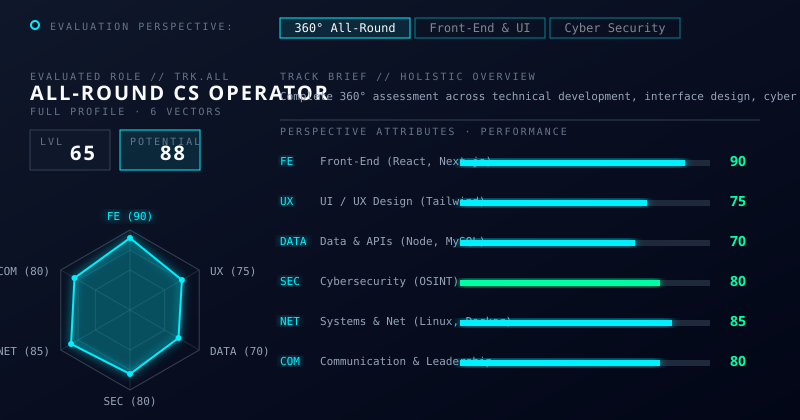

<!-- ========================================================================================= -->
<!--                    NEXUS // DIGITAL IDENTITY // HERO                                      -->
<!-- ========================================================================================= -->

<!-- High-Resolution Animated SVG Banner (Nexus ID) -->

  

<!-- Responsive Terminal Typing Stream -->

 

<!-- SYSTEM STATUS BADGES (Mobile Responsive) -->

 

 

<!-- ========================================================================================= -->
<!--                    01. EVALUATION PERSPECTIVE & SKILLS DASHBOARD                          -->
<!-- ========================================================================================= -->

<!-- Nexus Skills Radar & Progress Bars Dashboard -->

 

 

<!-- ========================================================================================= -->
<!--                    02. EXECUTABLE ARCHITECTURES // PROJECTS                               -->
<!-- ========================================================================================= -->

<!-- Custom SVG Banner for Projects -->

 

<table width="100%" style="border-collapse: collapse; border: none;">
<tr>
<td width="70%" valign="top">
| Project Designation | System Description | Core Technologies |
| :--- | :--- | :--- |
| **`[SYS.01] NU Wellness`** | **Booking & Consultant Management Platform** Scalable booking system with automated scheduling. |   |
| **`[SYS.02] Smart Carpooling`** | **Ride Sharing Platform** Eco-friendly student transportation network for route matching. |   |
| **`[SYS.03] Route Mapper`** | **Safe Navigation Concept** Interactive mapping tool identifying safe routes for walking. |   |
| **`[SEC.01] NetLabs`** | **Cybersecurity Explorations** Network packet analysis and vulnerability assessments. |   |
</td>
<td width="30%" align="center" valign="middle">
<!-- Custom SVG HUD placed next to Projects for aesthetic -->

</td>
</tr>
</table>

 

 

<!-- ========================================================================================= -->
<!--                    03. TELEMETRY & SYSTEM METRICS                                         -->
<!-- ========================================================================================= -->

<h2>📡 <code>SYSTEM TELEMETRY</code></h2>
 

<!-- Symmetrical Grid for Stats -->
<table width="100%" align="center" style="border-collapse: collapse; border: none;">
<tr>
<td width="50%" align="center" valign="top">

</td>
<td width="50%" align="center" valign="top">

</td>
</tr>
</table>

 

<!-- High-Tech Activity Snake -->
<picture>
<source media="(prefers-color-scheme: dark)" srcset="https://raw.githubusercontent.com/platane/snk/output/github-contribution-grid-snake-dark.svg">
<source media="(prefers-color-scheme: light)" srcset="https://raw.githubusercontent.com/platane/snk/output/github-contribution-grid-snake.svg">

</picture>

 

 

<!-- ========================================================================================= -->
<!--                    04. CONNECTION TERMINATION                                             -->
<!-- ========================================================================================= -->

+UNDERSTAND+->+TEST+->+SECURE+->+IMPROVE" alt="Mindset" />
 
<!-- Custom SVG Footer -->

