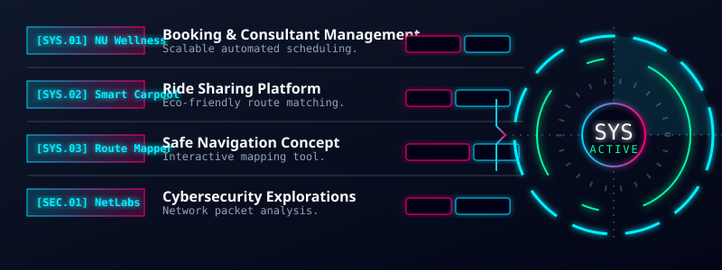

<!-- ========================================================================================= -->
<!--                    NEXUS // DIGITAL IDENTITY // HERO                                      -->
<!-- ========================================================================================= -->

<!-- High-Resolution Animated SVG Banner (Nexus ID) -->

  

<!-- Responsive Terminal Typing Stream -->

 

<!-- SYSTEM STATUS BADGES (Mobile Responsive) -->

<blockquote>
<i>"A 21-year-old fourth-year Computer Science student at Naresuan University with a strong interest in UX/UI Design, Front-End Development, and Software Development. Enjoys designing user-friendly interfaces and developing responsive, functional web applications with a focus on usability, performance, and user experience."</i>
</blockquote>

 

 

<!-- ========================================================================================= -->
<!--                    01. ACADEMICS & COMMUNICATIONS                                         -->
<!-- ========================================================================================= -->

<h2>🎓 <code>ACADEMICS & COMMUNICATIONS</code></h2>

<!-- Academics & Comms HUD -->

 

 

<!-- ========================================================================================= -->
<!--                    02. EVALUATION PERSPECTIVE & SKILLS DASHBOARD                          -->
<!-- ========================================================================================= -->

<!-- Nexus Skills Radar & Progress Bars Dashboard -->

 

### <code>[ SYS.SKILLS ]</code> EXPANDED TECHNICAL STACK

**`[ PROGRAMMING ]`** 

**`[ WEB DEVELOPMENT & DESIGN ]`** 

**`[ CORE OS & NETWORK ]`** 

**`[ AI-ASSISTED DEV ]`** 

 

 

<!-- ========================================================================================= -->
<!--                    03. EXECUTABLE ARCHITECTURES // PROJECTS                               -->
<!-- ========================================================================================= -->

<!-- Custom SVG Banner for Projects -->

 
<!-- Unified SVG Dashboard for Projects & HUD -->

 

### <code>[ PROJECT.DEEP_DIVE ]</code> Wellness Center | Healthcare Web App
**Role:** Front-End Developer & Database Management
- Developed responsive user interfaces using Next.js, TypeScript, and Tailwind CSS.
- Implemented reusable components and optimized UI performance for large-scale data rendering.
- Integrated RESTful APIs to support dynamic data visualization and user interactions.
- Built dashboard interfaces for analytics and reporting features.
- Improved page load performance and reduced client-side latency through frontend optimization.
- Implemented data aggregation pipelines for analytics and reporting systems.
- Designed scalable data models supporting complex filtering and high-volume queries.
- Collaborated with backend developers using Git (Pull Requests, code reviews).

 

 

<!-- ========================================================================================= -->
<!--                    04. OPERATIONAL HISTORY & DEPLOYMENTS                                  -->
<!-- ========================================================================================= -->

<h2>🌍 <code>OPERATIONAL HISTORY & DEPLOYMENTS</code></h2>

 

<!-- Operational History Timeline HUD -->

 

 

<!-- ========================================================================================= -->
<!--                    05. TELEMETRY & SYSTEM METRICS                                         -->
<!-- ========================================================================================= -->

<h2>📡 <code>SYSTEM TELEMETRY</code></h2>

 

  
  &nbsp;&nbsp;
  

  

<!-- High-Tech Activity Snake -->
<picture>
<source media="(prefers-color-scheme: dark)" srcset="https://raw.githubusercontent.com/platane/snk/output/github-contribution-grid-snake-dark.svg">
<source media="(prefers-color-scheme: light)" srcset="https://raw.githubusercontent.com/platane/snk/output/github-contribution-grid-snake.svg">

</picture>

 

 

<!-- ========================================================================================= -->
<!--                    06. CONNECTION TERMINATION                                             -->
<!-- ========================================================================================= -->

+UNDERSTAND+->+TEST+->+SECURE+->+IMPROVE" alt="Mindset" />
 
<!-- Custom SVG Footer -->

